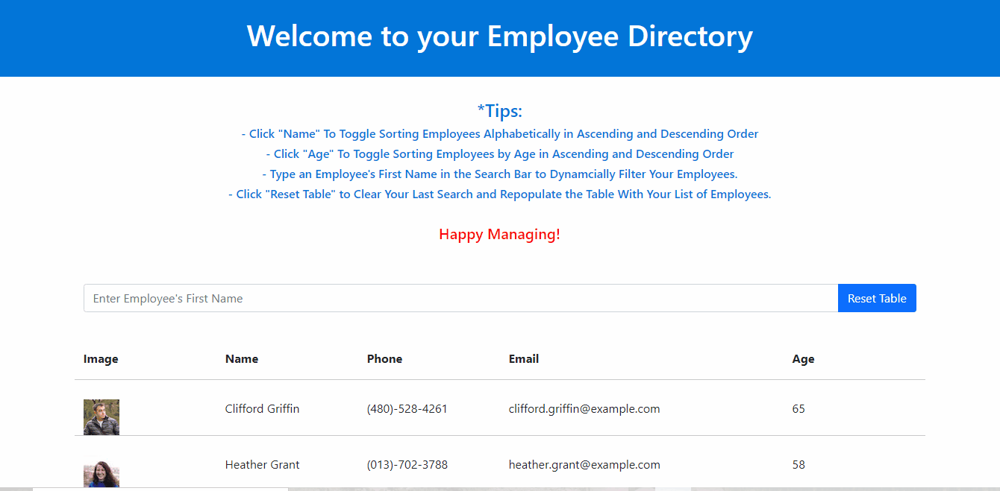

# Employee Directory

A React app for viewing and sorting your employees, by Seth Zygarlicke.

### Links

* Github Repository: [https://github.com/ElderBass/Employee-Directory.git](https://github.com/ElderBass/Employee-Directory.git)
* Deployed: [https://elderbass.github.io/Employee-Directory/](https://elderbass.github.io/Employee-Directory/)

## Table of Contents


* [Description](#description)

* [Technologies](#technologies)
    
* [Installation](#installation)
    
* [Contributing](#contributing)
    
* [Questions](#questions)

## Description

Employee Director is a React app for managers, allowing them to view and sift through their directory of employees.

Upon loading the page, the company's entire directory of employees will populate the page in a neatly ordered table. This table consists of the most relevant information about each employee - a thumbnail of their headshot, their full name, email, phone number, and age.

The manager will also immediately note a list of tips to help guide them through how to use the app. The manager can click on the "Name" column to sort their employees alphabetically in ascending order. If they click "Name" again, the table will sort employee first names by DESCENDING order. 

The manager can also click on the "Age" column to sort employees in a similar fashion. The first click will sort the employees in ascending order. A second click will reverse that order. 

Finally, the manager can type an employee's first name in the search bar to filter the table of employees dynamically based on the manager's input. Only those employees that start with the letters the manager inputs will populate the table. To revert back to the old table, the manager must simply click the "Reset Table" button.

### Demonstration




## Technologies

Employee Directory is a React app, and as such many of the tecnologies used within are bundled inside the React, such as Babel.

Other packages used in this application include Axios, for making the API call to the external "random user" API, 

All of the code was written in the VS Code program.  

## Installation

You know, to be quite frank, I'm not sure you even need to do this installation. I honestly don't know how this works with React. Normally, to run something like this, you just clone down the repository and run the command
```
npm i
```
to install all the packages contained within.

However, since this is the first React app I've ever made, I'm not quite sure what you would do if you cloned this down. However, in order to create a new React app of your own (if you even need to) run this command in your terminal:

```
npx create-react-app employee-directory
```

## Contributing

If you wish to contribute to this repository, feel free to fork it to your local machine and do with it as you please.

## Questions 

If you have any questions or comments about this repo, email the creator Seth at [zygster11@gmail.com](zygster11@gmail.com)

For more projects by Seth, visit his Github page at [https://github.com/ElderBass](https://github.com/ElderBass)